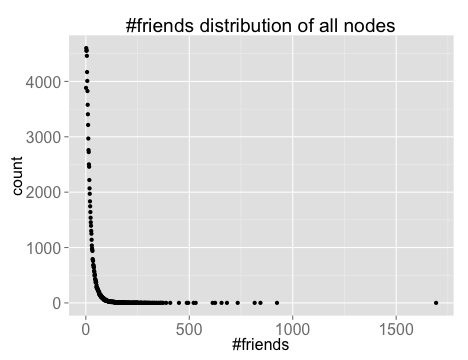
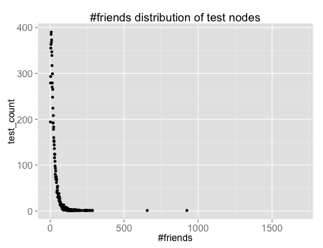

--- 
title       : Link Prediction
subtitle    : Social Network Analysis HW2
author      : 'R03922142 Yu Ran , R03922145 Yi Huang , R03944049 Bowen Yuan'
job         : 
framework   : io2012        # {io2012, html5slides, shower, dzslides, ...}
highlighter : highlight.js  # {highlight.js, prettify, highlight}
hitheme: zenburn      # 
widgets     : [mathjax]            # {mathjax, quiz, bootstrap}
mode        : selfcontained # {standalone, draft}
knit        : slidify::knit2slides
github:
    user: hyiiego
    repo: present_demo
--- 

<!-- Limit image width and height -->

<!-- Center image on slide -->

## All the way down

&nbsp;

&nbsp;

### - Explore the graph

### - Select candidate

### - Probe baseline method

### - Experiment learning method 

### - Compare method

--- &twocol w1:40% w2:40%

## Distributions

&nbsp;

*** =left

 

*** =right

 

--- 

## Candidate Selection

from all nodes in graph to people who is within 3-step distance from the target node

&nbsp;

 

---

## Preliminary Probes

### Methods Based on Node Neighborhoods
  - Common Neighbors(F1-score:0.103298 MAP:0.083843)
  
  - Jaccard's coefficient
  - Adamic/Adar $\bigstar$ (F1-score:0.112816 MAP:0.083212)
  
  - Resource Allocation Index
  
  
### Methods Based on All Paths
  - Preferential Attachment
  
### With Community Information

---

## Number of recommmendation

&nbsp;

### - Based on threshold

### - Corresponding to degree

Common Neighbors:50%

Adamic/Adar: 30%

---

## Learning Method

### Collaborative Filtering

using adjacency matrix as feature

### Classification(one-class & two-class)

- Data Sampling - select training set and validate set

- Feature extraction - combine user profile and topological features

- Models - logistic regression, SVM

---

## Tools and Packages

&nbsp;

### - Graphlab

### - NetworkX

### - Scikit-learn

### - MongoDB

---

## Conclusion

&nbsp;

### - from bottom to top

### - deal with unbalancing

### - time is everything

--- 

&nbsp;

&nbsp;

&nbsp;

&nbsp;

&nbsp;

&nbsp;

&nbsp;

&nbsp;

## Thank You!

